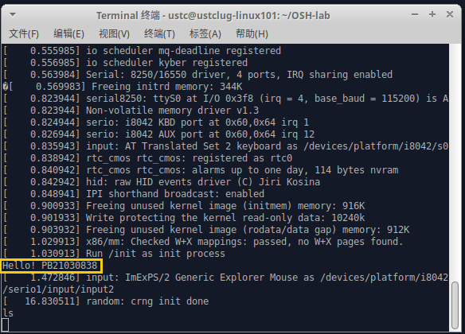

# OSH lab1
**罗浩铭PB21030838**

## 选做：内核裁剪分析
> 分析哪些选项能够切实地影响编译后的内核大小或编译的时间


1. 我们先去除了可视化、电源管理、IA32模拟器、无线网络、硬件驱动（无线网络、图形渲染等不需要支持的硬件），得到的内核大小为8.8MB
2. 我们再去除了安全、加密算法、部分文件系统管理（监控目录变更的inotify、管理磁盘限额的quota）、几乎全部硬件驱动（除了real time clock）、block layer的几乎全部（除了Legacy autoloading support），得到的内核大小为6.8MB，编译时间为11分45秒
3. 我们接着去除了Plan 9支持、ELF与MISC二进制文件支持、部分分支预测功能（IBPB viz. Indirect Branch Predictor Barrier, IBRS viz. Indirect Branch Restricted Speculation），得到的内核大小为6.5MB，编译时间为11分33秒
4. 再去除kernel hacking中除了Stack backtrace support的全部，得到的内核大小为5.5MB，编译时间为10分44秒
5. 接着去除网络中的RF switch子系统支持、kprobes、缓冲区溢出检测、seccomp机制（用于安全执行不受信任的代码）、无名内存分页，得到的内核大小为5.4MB，编译时间为10分45秒
6. 添加回kprobes、缓冲区溢出检测、无名内存分页，去除CPU运行情况监控、Mitigations for speculative execution vulnerabilities的全部，得到的内核大小为4.9MB，编译时间为11分03秒
7. 最后一轮，去除所有网络支持，得到的内核大小为3.3MB，编译时间为6分32秒
8. 加回IA32 emulation与可执行文件支持以适配实验第二步，得到的内核大小为3.3MB，编译时间为6分52秒
  
则我们大致可以得到：切实地影响内核大小及编译时间的主要因素为：网络协议栈、可视化（不确定）、硬件驱动（不确定）、漏洞缓解补丁、内核调试等（已经大致按影响程度排序）
  

注：获取编译时间所用命令为
```txt
echo $(date "+%Y-%m-%d %H:%M:%S") && make -j1 && echo $(date "+%Y-%m-%d %H:%M:%S")
```


## 选做：交叉编译


## 创建初始内存盘
如图，创建成功，成功显示学号：


## 选做：Kernel Panic分析
Kernel Panic是操作系统内核在检测到内部致命错误时采取的一项安全措施（可以理解成更严重一级的exception?），此时操作系统可能无法安全从错误中恢复，或者继续运行将面临重大数据丢失风险。该机制主要用于Unix和类Unix系统，类似于Windows系统里的蓝屏机制。
只需简单地在程序里面加入除零错误就可以轻松触发kernel panic:
```txt
[    1.001917] Run /init as init process
Hello! PB21030838
[    1.043911] traps: init[1] trap divide error ip:401d26 sp:7ffe2158abb0 error:0 in init[401000+94000]
[    1.046910] Kernel panic - not syncing: Attempted to kill init! exitcode=0x00000008
[    1.046910] CPU: 0 PID: 1 Comm: init Not tainted 6.2.8 #8
[    1.046910] Hardware name: QEMU Standard PC (i440FX + PIIX, 1996), BIOS 1.13.0-1ubuntu1.1 04/01/2014
[    1.046910] Call Trace:
[    1.046910]  <TASK>
[    1.046910]  dump_stack_lvl+0x37/0x50
[    1.046910]  panic+0x2e6/0x300
[    1.046910]  do_exit+0x876/0xa10
[    1.046910]  do_group_exit+0x2c/0x80
[    1.046910]  get_signal+0x88f/0x890
[    1.046910]  ? _raw_spin_unlock_irqrestore+0x17/0x20
[    1.046910]  arch_do_signal_or_restart+0x29/0x260
[    1.046910]  ? force_sig_fault_to_task+0x61/0x80
[    1.046910]  exit_to_user_mode_prepare+0x98/0x110
[    1.046910]  irqentry_exit_to_user_mode+0x9/0x20
[    1.046910]  asm_exc_divide_error+0x1a/0x20
[    1.046910] RIP: 0033:0x401d26
[    1.046910] Code: 00 00 00 00 e9 4b ff ff ff f3 0f 1e fa 55 48 89 e5 48 83 ec 10 48 8d 3d ec 32 09 00 e8 53 f9 00 00 8b 45 fc b9 00 00 00 00 99 <f7> f9 89 45 fc eb f0 0f 1f 00 53 48 81 ec 88 00 00 00 48 85 ff 74
[    1.046910] RSP: 002b:00007ffe2158abb0 EFLAGS: 00000206
[    1.046910] RAX: 0000000000000000 RBX: 0000000000400518 RCX: 0000000000000000
[    1.046910] RDX: 0000000000000000 RSI: 0000000000ffab50 RDI: 00000000004c2c70
[    1.046910] RBP: 00007ffe2158abc0 R08: 0000000000000012 R09: 000000000000007c
[    1.046910] R10: 00000000004c0800 R11: 0000000000000246 R12: 0000000000402db0
[    1.046910] R13: 0000000000000000 R14: 00000000004c0018 R15: 0000000000000000
[    1.046910]  </TASK>
[    1.046910] Kernel Offset: 0x3d400000 from 0xffffffff81000000 (relocation range: 0xffffffff80000000-0xffffffffbfffffff)
[    1.046910] ---[ end Kernel panic - not syncing: Attempted to kill init! exitcode=0x00000008 ]---
```
则只需要在init.c中触发异常，令init进程的执行被中断；或者令init.c的运行对操作系统的其它重要部分造成破坏（如内核堆栈溢出、指针异常访问等）时，就会触发Kernel Panic.


## 附：实验要求
实验一完成后，你的 osh-2023-labs 作业仓库应具有这样的结构：

```txt
osh-2023-labs
- README.md
- lab0
- lab1
  - README.md      // 可选，建议在此文件中介绍你的实验过程
  - syscall
    - bzImage
    - initrd.c
  - riscv/arm/...  // 可选，该目录命名为选择的交叉编译的平台（如选择 arm 则命名为 arm）
    - bzImage      // 交叉编译得到的内核镜像文件
  - bzImage
  - .config        // 可选，编译内核时的配置文件
  - initrd.cpio.gz
```


